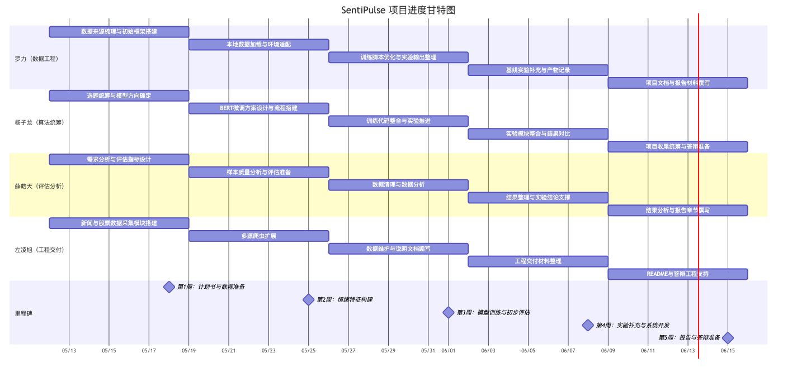
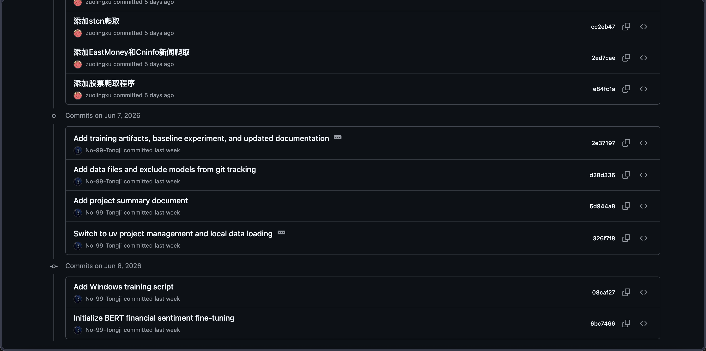
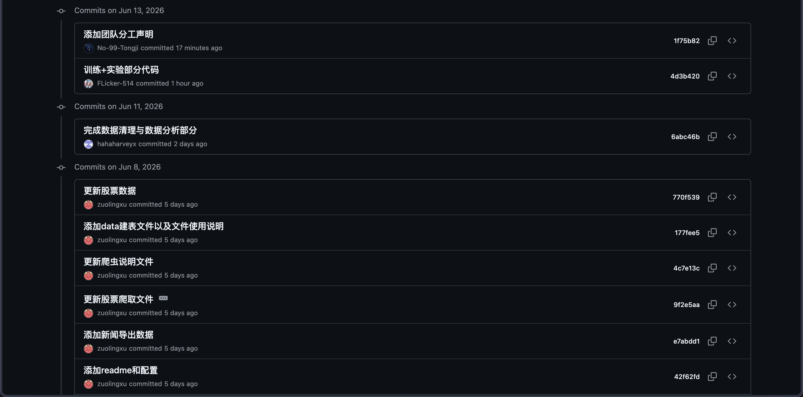

# 团队分工声明

本项目《SentiPulse》团队共 4 名成员，分别负责数据工程、算法建模、评估分析、工程交付等模块。项目过程中采用”线上会议 + 即时沟通 + 在线文档 + GitHub 协同”的方式开展合作，并以 GitHub 提交记录作为可量化贡献的重要依据。现根据仓库实际开发记录，对各成员在五周周期内的工作完成情况声明如下。

---

## 一、团队成员与职责对应

### 1. 罗力（数据工程负责人）

罗力在项目中实际承担了数据爬取、数据清洗、数据融合、特征工程等工作，可考核输出包括数据预处理代码、新闻爬虫代码、数据血缘图、字段说明等。具体完成了以下工作：

- 完成 BERT 金融情绪分类训练主流程的初始搭建
- 完成本地数据加载与训练框架联调
- 完成项目环境管理切换（`uv`）及训练脚本适配
- 补充数据文件纳入方式、模型文件排除策略与仓库结构整理
- 参与实验产物整理与总结文档完善

对应提交记录：

- `Initialize BERT financial sentiment fine-tuning`
- `Add Windows training script`
- `Switch to uv project management and local data loading`
- `Add project summary document`
- `Add data files and exclude models from git tracking`
- `Add training artifacts, baseline experiment, and updated documentation`

### 2. 杨子龙（项目负责人兼算法负责人）

杨子龙在项目中实际承担了 BERT 微调、LSTM 模型训练与调参、项目整体统筹等工作，可考核输出包括 BERT 微调代码、LSTM 训练代码、模型权重、超参数记录、训练日志与阶段性进度汇总。具体完成了以下工作：

- 负责训练与实验部分核心代码的整合与提交
- 推进 BERT 微调实验方案落地，并形成训练与实验模块的集中实现
- 统筹项目整体算法方向与实验推进节奏
- 对阶段性实验工作进行集中整理，推动项目从代码实现转入结果固化阶段

对应提交记录：

- `训练+实验部分代码`

### 3. 薛皓天（评估与分析负责人）

薛皓天在项目中实际承担了回测评估、消融实验、结果可视化、错误分析等工作，可考核输出包括评估代码、实验结果表、可视化图表与实验分析章节。具体完成了以下工作：

- 完成数据清理与数据分析部分工作
- 参与实验数据的整理、统计与结果分析
- 为后续模型评估、报告撰写和结果对比提供分析支撑
- 对项目中的分析性内容形成阶段性成果

对应提交记录：

- `完成数据清理与数据分析部分`

### 4. 左凌旭（工程与交付负责人）

左凌旭在项目中实际承担了 Pipeline 整合、后端 API、前端 Dashboard、README、PPT 等工程交付工作，可考核输出包括可运行完整代码、交互界面、README 以及演示材料。具体完成了以下工作：

- 完成股票数据爬虫、财经新闻爬虫等多源采集模块开发
- 增加 EastMoney、Cninfo、STCN 等新闻采集能力
- 完成股票爬取脚本与数据文件更新
- 补充 README、配置说明、建表文件和使用说明
- 形成工程侧可复用的数据抓取与数据导出基础

对应提交记录：

- `添加股票爬取程序`
- `添加EastMoney和Cninfo新闻爬取`
- `添加stcn爬取`
- `添加readme和配置`
- `添加新闻导出数据`
- `更新股票爬取文件`
- `更新爬虫说明文件`
- `添加data建表文件以及文件使用说明`
- `更新股票数据`

---

## 二、五周项目进度对应的成员工作声明

### 第 1 周：计划书与数据准备

第 1 周的实际工作围绕**计划书与数据准备**展开，主要完成了明确选题、完成项目计划书、确定团队分工、明确数据来源并获取数据、完成模型选型等任务。

本周各成员完成情况如下：

- **杨子龙**：负责项目整体选题统筹与模型方向确定，推动项目采用情绪分析路线，明确以 BERT 作为核心基座模型的实验方向。
- **罗力**：参与数据来源梳理，完成项目初始训练框架搭建，为后续数据接入和模型训练准备基础代码结构。
- **左凌旭**：启动数据采集相关工作，搭建新闻与股票数据获取模块，为初始数据集和仓库结构形成提供支持。
- **薛皓天**：参与前期需求分析与评估指标讨论，为后续实验结果分析与可视化设计提供思路。

本周阶段性交付与实际记录相符，主要体现为：项目方向明确、仓库结构逐步建立、数据获取与模型选型开始落地。

---

### 第 2 周：情绪特征构建

第 2 周的实际工作围绕**情绪特征构建**展开，主要完成了微调 BERT 模型、初步接入新闻摘要能力、完成数据清洗和数据特征总结等任务。

本周各成员完成情况如下：

- **杨子龙**：推进 BERT 微调实验主体方案，明确模型训练逻辑与实验流程，承担算法实现主责。
- **罗力**：完成本地数据加载、环境适配与训练脚本优化，支持 BERT 微调流程稳定运行；同时推进数据清洗与数据组织方式规范化。
- **左凌旭**：继续扩展新闻爬虫与股票数据采集模块，完善 EastMoney、Cninfo、STCN 等来源接入，为情绪文本构建提供更多原始材料。
- **薛皓天**：配合整理数据分析思路，关注样本质量与后续评估需要，为特征总结和实验分析做准备。

本周阶段目标在仓库中主要体现为：BERT 微调主流程初步成型，新闻与股票数据采集模块明显扩展，数据处理链路逐渐清晰。

---

### 第 3 周：模型训练与初步评估

第 3 周的实际工作围绕**模型训练与初步评估**展开，主要完成了训练模型、记录超参数与训练日志、完成部分实验结果整理等任务。

本周各成员完成情况如下：

- **杨子龙**：集中完成训练与实验部分代码，推动模型训练代码与实验流程进入稳定阶段，是本周模型训练推进的主要负责人。
- **罗力**：补充训练脚本、实验输出整理、超参数记录与文档说明，完成训练日志和结果文件的沉淀工作。
- **薛皓天**：完成数据清理与数据分析部分，为模型效果评估与后续实验结果解释提供支撑。
- **左凌旭**：维护数据采集与说明文档，为模型训练所依赖的数据输入保持可用，并支撑项目工程侧连续推进。

本周阶段性交付物主要体现为：训练代码可运行、实验过程可记录、初步实验结果可复查。

---

### 第 4 周：消融实验与系统开发

第 4 周的实际工作围绕**实验补充与系统开发**展开，主要完成了消融实验、未微调基线评估、实验产物整理以及工程侧交付准备。本周工作集中体现为”实验补充 + 工程能力巩固”：

- **杨子龙**：推进训练与实验模块进一步整合，为后续实验扩展和结果对比提供核心支撑。
- **罗力**：补充实验产物记录，完成训练结果、超参数、Loss 记录与文档总结，体现了对实验可追溯性的完善。
- **薛皓天**：继续承担评估分析相关工作，对数据分析结果与实验输出进行整理，支撑实验结论形成。
- **左凌旭**：继续负责采集工程、数据导出、说明文档与工程交付材料的整理，为系统展示和后续答辩材料准备打下基础。

---

### 第 5 周：报告与答辩准备

第 5 周的实际工作围绕**报告与答辩准备**展开，主要完成了项目报告、团队分工声明、答辩 PPT 等收尾交付物。

本周各成员完成情况如下：

- **杨子龙**：承担项目整体收尾统筹，推进训练与实验部分结果形成最终可展示内容。
- **罗力**：完成项目总结文档、实验记录整理、微调流程原理说明等报告性材料撰写，支撑项目报告成文。
- **薛皓天**：参与结果分析内容组织，为实验章节、分析部分与结论撰写提供素材基础。
- **左凌旭**：负责 README、配置说明、工程使用说明等交付型文档整理，并为答辩展示材料准备提供工程支持。

本周工作重点已经从”实现”转向”整理、总结与展示”，形成了最终报告、分工声明、PPT 与演示材料。

---

## 三、总体说明

综合 GitHub 仓库实际提交记录，本项目团队分工清晰、协作方式明确，各成员均围绕既定职责完成了相应工作：

- **罗力**主要承担数据处理、训练流程搭建、实验结果整理与文档总结工作；
- **杨子龙**主要承担项目统筹与算法训练核心工作；
- **薛皓天**主要承担数据分析、评估支撑与实验分析工作；
- **左凌旭**主要承担数据采集、工程模块、说明文档与交付支持工作。

团队在五周周期内按照”计划制定 → 数据准备 → 特征构建 → 模型训练 → 结果整理与答辩准备”的节奏推进，仓库提交记录能够对成员贡献形成明确支撑，本声明与实际开发过程和仓库留痕记录相一致。
