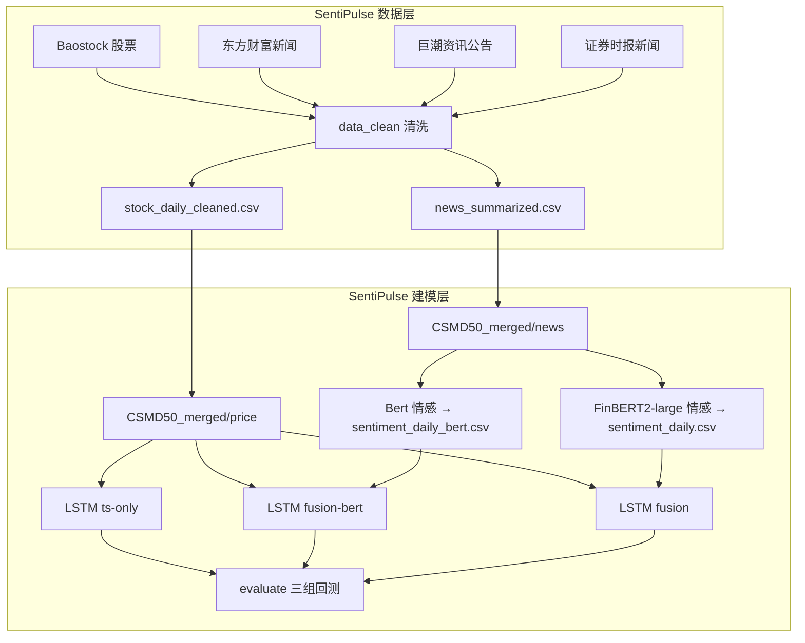
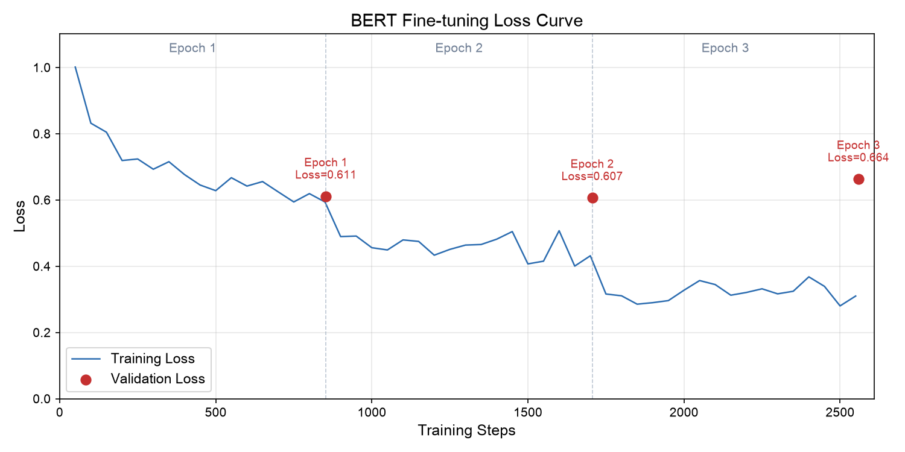

# SentiPulse 项目流程与原理说明

> **课程项目**：舆情脉动（SentiPulse）· A 股新闻情绪分析与股价预测  
> **代码仓库**：`SentiPulse/`（数据采集、清洗、建模、训练、评估一体）  
> **文档版本**：v1.1 · 2026-06

---

## 一、项目总览

### 1.1 仓库模块分工

| 模块 | 路径 | 核心工作 |
|------|------|----------|
| **数据采集** | `data_crawler/` | 爬取股票日线 + 三类新闻 |
| **数据清洗** | `data_clean/` | 规则清洗 + DeepSeek 摘要 |
| **建模训练** | `theory/` + `run.py` | 情感特征 → LSTM 训练 → 回测对比 |
| **BERT 微调** | `src/` | 金融情感微调（课程展示，可选） |

一体化流程：

```
data_crawler/ → data_clean/ → data/processed/ → theory/ → run.py
```

**数据立场（报告用）**：本项目**不使用第三方成品数据集**，价量与新闻均由团队基于 `data_crawler/` 自主爬取，经 `data_clean/` 清洗后入库。CSMD50 仅作为**目录命名与存储格式**的参考，不代表外部数据导入。

### 1.2 研究问题

验证 **「新闻情感 + 价量时序」融合预测** 是否优于 **纯价量 LSTM**，并对比：

1. **无 BERT** 的纯时序基线（`ts-only`）
2. **通用 Bert** 的情感融合（`fusion-bert`，`bert-base-chinese` 预训练权重）
3. **金融 FinBERT2-large** 的情感融合（`fusion`，预训练权重直接推理，**无需微调**）

### 1.3 技术栈

| 层次 | 技术 |
|------|------|
| 数据采集 | Baostock、东方财富 API、巨潮资讯、证券时报（Playwright/Selenium） |
| 数据清洗 | pandas、DeepSeek API（新闻摘要） |
| 情感分析 | Hugging Face Transformers、Bert / FinBERT2-large |
| 股价预测 | TensorFlow/Keras LSTM |
| 评估 | 滚动回测、MAE、方向准确率 |
| 运行环境 | Conda 环境 `FinBERT`、GPU 服务器 |

---

## 二、目标股票与数据时间线

### 2.1 10 只 A 股龙头（自主采集标的）

| 企业 | 代码 | 板块 |
|------|------|------|
| 贵州茅台 | sh.600519 | 上交所 |
| 工商银行 | sh.601398 | 上交所 |
| 交通银行 | sh.601328 | 上交所 |
| 保利发展 | sh.600048 | 上交所 |
| 国电南瑞 | sh.600406 | 上交所 |
| 恒瑞医药 | sh.600276 | 上交所 |
| 海光信息 | sh.688041 | 科创板 |
| 海天味业 | sh.603288 | 上交所 |
| 海尔智家 | sh.600690 | 上交所 |
| 金山办公 | sh.688111 | 科创板 |

股票选取参考 CSMD50 龙头名单，但**行情与新闻均由本团队自行爬取**，非直接下载现成数据集。

### 2.2 数据时间范围（自主采集）

| 数据类型 | 时间范围 | 采集方式 |
|----------|----------|----------|
| **股票日线** | 2021-01-04 ~ 2026-06（可按需向前追溯） | Baostock API，`data_crawler/stock/` |
| **东方财富新闻** | 2025-12 ~ 2026-06 | 东方财富搜索 API |
| **巨潮资讯公告** | 2025-01-07 ~ 2026-06 | cninfo 爬虫 + PDF 正文提取 |
| **证券时报新闻** | 2024-08 ~ 2026-06 | Playwright 浏览器爬取 stcn.com |

> **报告表述**：实验所用**结构化价量数据**与**非结构化新闻文本**均通过本项目爬虫模块获取，经统一清洗流水线处理后进入建模环节。不同新闻源的覆盖时段因网站接口限制而有所差异，已在数据质量分析中说明。

### 2.3 训练/测试划分（默认）

| 集合 | 时间 | 用途 |
|------|------|------|
| **训练集** | `Date < 2024-01-01` | LSTM 训练（约 2021–2023） |
| **测试集** | `Date >= 2024-01-01` | `evaluate` 回测对比 |

---

## 三、自主数据采集详解（SentiPulse）

> 本章对应报告「数据来源」章节：**所有原始数据均由团队爬取，不引用第三方成品数据集。**

### 3.1 四类数据源（自主爬取）

```
┌─────────────────────────────────────────────────────────────┐
│                    SentiPulse 数据源                         │
├──────────────┬──────────────────────────────────────────────┤
│ Baostock     │ A 股日线 OHLCV（不复权/前复权/后复权）         │
│ 东方财富      │ 财经新闻报道（标题+摘要）                      │
│ 巨潮资讯      │ 上市公司法定公告（PDF 正文提取）              │
│ 证券时报      │ stcn.com 个股相关新闻（Playwright 爬取）       │
└──────────────┴──────────────────────────────────────────────┘
```

| 数据源 | 爬虫模块 | 原始文件 | 数据类型 | 采集原理 |
|--------|----------|----------|----------|----------|
| **Baostock** | `data_crawler/stock/` | `data/stock/stock_daily.csv` | 结构化价量 | 调用 `query_history_k_data_plus` 拉取日线 OHLCV |
| **东方财富** | `data_crawler/news/eastmoney_crawler.py` | `data/news/news_eastmoney.csv` | 财经新闻 | 按公司名+代码搜索，聚合权威媒体快讯 |
| **巨潮资讯** | `data_crawler/news/cninfo_crawler.py` | `data/news/news_cninfo.csv` | 法定公告 | 爬取交易所指定披露平台公告，PyMuPDF 提取 PDF 正文 |
| **证券时报** | `data_crawler/news/stcn_scripts/` | `data/news/news_stcn.csv` | 财经新闻 | Playwright 模拟浏览器，人工过验证码后滚动翻页 |

**价量字段**：`StockCode, Date, Open, High, Low, Close, Adj Close, Volume`  
**单位**：人民币元/股，成交量为股数。  
**采集规模**（当前仓库）：约 10 股 × 343 交易日 × 3 种复权（价量）；新闻合计约 **9,800+** 条（东方财富 5,230 + 巨潮 3,417 + 证券时报 1,208）。

### 3.1.1 爬虫技术要点（可写入报告）

| 要点 | 说明 |
|------|------|
| 多源融合 | 4 个异构数据源，覆盖「行情 + 媒体报道 + 法定公告」 |
| 反爬应对 | 请求间隔、重试退避；STCN 使用 Playwright + 验证码 |
| 可追溯性 | 每条新闻保留 `来源`、`URL`（公告类），便于审计 |
| 可复现 | 代码位于 `SentiPulse/data_crawler/`，配置见 `config.py` |
| 时间可扩展 | Baostock 可将 `START_DATE` 调至 `2019-01-01` 以扩充历史价量 |

### 3.2 数据清洗（`SentiPulse/data_clean/`）

**输入**：

```
stock_daily.csv
news_cninfo.csv
news_eastmoney.csv
news_stcn.csv
```

**处理流程**：

```
原始数据
  → 字段统一（企业/日期/来源/标题/正文）
  → 股票清洗（日期规范、异常值剔除、去重）
  → 新闻规则抽取核心内容（去噪、截断 4000 字）
  → DeepSeek 客观摘要（每条新闻 → 一段「内容」）
  → 统计分析报告
```

**输出**（`data_clean/output/`）：

| 文件 | 字段 | 说明 |
|------|------|------|
| `stock_daily_cleaned.csv` | `StockCode,Date,Open,High,Low,Close,Adj Close,Volume` | 清洗后股票日线 |
| `news_summarized.csv` | `企业,日期,来源,内容` | **LLM 摘要后的新闻**（`内容` 列写入建模 `text`） |
| `intermediate/news_core_content.csv` | 含 `原始正文,核心内容` | 调试用中间产物 |

**原理**：
- 规则方法去除免责声明、页眉页脚等噪声
- DeepSeek 将长文压缩为客观事实摘要，降低 FinBERT 输入长度与噪声
- 股票清洗保证 OHLCV 逻辑一致（High ≥ Low 等）

---

## 四、数据入库与格式转换

### 4.1 目录结构（`data/processed/`）

```
data/processed/
├── CSMD50_merged/         # 价量 + 新闻（标准格式）
├── datasets/              # 单股训练 CSV
├── CSMD_cleaned.csv       # 全市场合并价量
├── sentiment_daily.csv    # FinBERT2-large 情感
└── sentiment_daily_bert.csv # Bert 情感
```

### 4.2 新闻 CSV 格式

`scripts/import_sentipulse_data.py` 将 `data_clean/output/` 的清洗结果转为建模标准格式，写入 `CSMD50_merged/`。

```csv
code_name,ticker,created_at,text
贵州茅台,sh.600519,2025-03-21,公司发布2024年度报告摘要。营业收入...
```

| 列 | 含义 | 来源映射 |
|----|------|----------|
| `code_name` | 股票中文名 | `news_summarized.csv` 的 `企业` |
| `ticker` | baostock 代码 | 如 `sh.600519` |
| `created_at` | 新闻日期 | `日期` |
| `text` | 新闻正文/摘要 | `内容`（LLM 摘要） |

### 4.3 数据入库脚本

`scripts/import_sentipulse_data.py` 将 `data_clean/output/` 的清洗结果转为建模标准格式，写入 `CSMD50_merged/`。

```bash
# 将清洗后的价量与新闻摘要转为 price/ + news/ 结构
python scripts/import_sentipulse_data.py

# 生成训练用 datasets、CSMD_cleaned.csv 等
python run.py setup-data --dataset CSMD50_merged --rebuild
```

**`setup-data` 原理**：
- 读取 `price/<股票>.csv`，转换为 `datasets/<股票>.csv`（增加 `Prev Close, VWAP` 等）
- 合并所有股票价量 → `CSMD_cleaned.csv`
- 聚合新闻文本 → `csmd_news.json`

---

## 五、流水线各步骤详解

### 步骤 0：环境准备

```bash
conda activate FinBERT
cd ~/yangzilong/SentiPulse

export BERT_MODEL_PATH=../models/Bert
export SENTIMENT_MODEL_PATH=../models/FinBERT2-large
```

**原理**：PyTorch 负责 BERT 情感推理，TensorFlow 负责 LSTM 训练，共用同一 Conda 环境。

---

### 步骤 1：自主数据采集（SentiPulse `data_crawler/`）

**工作**：团队自行从四个公开来源爬取 10 只股票的价量与新闻，**不下载第三方成品数据集**。

**命令**（在 SentiPulse 目录）：

```bash
cd ~/yangzilong/SentiPulse/data_crawler
python main.py
```

**配置**（`config.py`）：

```python
STOCKS = {"贵州茅台": "600519", "工商银行": "601398", ...}  # 10 只
START_DATE = "2025-01-01"   # 价量可改为 "2021-01-01" 扩充历史
END_DATE   = "2026-06-06"
```

**原理**：
- **股票**：Baostock 开源接口，数据与上交所官网一致，支持不复权/前复权/后复权
- **新闻**：三源并行——东方财富（媒体快讯）、巨潮资讯（法定公告）、证券时报（权威财经报道）
- **关键词策略**：每只股票按「中文公司名 + 6 位代码」双关键词检索，提高召回率
- **稳健性**：`REQUEST_TIMEOUT`、`MAX_RETRIES`、随机延时，降低封禁风险

---

### 步骤 2：数据清洗与 LLM 摘要（SentiPulse `data_clean/`）

**工作**：合并多源新闻、清洗股票数据、DeepSeek 生成客观摘要。

**命令**：

```bash
cd ~/yangzilong/SentiPulse/data_clean
export DEEPSEEK_API_KEY="你的密钥"
python run_clean_and_analyze.py
```

**输出**：`output/news_summarized.csv`（`内容` 列供下游使用）

**原理**：
- 多源新闻去重、字段对齐
- LLM 摘要保留事实、去除冗余，使情感模型输入更干净
- 数据分析报告用于课程报告中的「数据规模与质量」章节

---

### 步骤 3：数据入库（`setup-data`）

**工作**：将自主爬取并清洗后的数据，转换为建模标准格式。

**命令**：

```bash
cd ~/yangzilong/SentiPulse
python run.py setup-data --dataset CSMD50_merged --rebuild
```

**产出**：
- `CSMD_cleaned.csv`（12720 行，10 股合并价量）
- `datasets/<股票>.csv`
- `csmd_news.json`

---

### 步骤 4：情感特征构建（`build-sentiment`）

**工作**：用 Bert / FinBERT2-large 对每条新闻做情感推理，按交易日聚合为日度特征。

**命令**（模型在同级 `../models/`）：

```bash
cd ~/yangzilong/SentiPulse

export BERT_MODEL_PATH=../models/Bert
export SENTIMENT_MODEL_PATH=../models/FinBERT2-large

python scripts/build_sentiment_both.py \
  --variant both --dataset CSMD50_merged --symbols 贵州茅台
```

**输出**：

| 文件 | 情感模型 | 用途 |
|------|----------|------|
| `sentiment_daily_bert.csv` | `bert-base-chinese` | `fusion-bert` 训练 |
| `sentiment_daily.csv` | `FinBERT2-large` | `fusion` 训练 |

**日度特征字段**：

```
Date, Symbol, signed_score, positive, negative, label, confidence
```

**原理**：

```
每日新闻 text₁, text₂, ... 
    → 拼接为一段文本
    → BERT 二分类推理 → P(positive), P(negative)
    → signed_score = P(pos) - P(neg)  ∈ [-1, 1]
    → 写入 sentiment_daily*.csv
```

- `signed_score > 0`：偏正面，可能推升预测价
- `signed_score < 0`：偏负面，可能压低预测价
- 无新闻日：`signed_score = 0`

**模型路径**（不设环境变量时自动解析）：
- `fusion-bert` → `../models/Bert`
- `fusion` → `../models/FinBERT2-large`

---

### 步骤 5：情感模型对比（可选）

**工作**：在同一批新闻上对比 Bert vs FinBERT2-large 的判断差异。

```bash
python - <<'PY'
from pathlib import Path
from theory.sentiment_model.compare_sentiment import compare_sentiment_models
r = compare_sentiment_models(n=50, symbol="贵州茅台", seed=42,
    news_root=Path("data/processed/CSMD50_merged/news"))
print("标签一致率:", r["label_agreement_rate"])
print("平均分数差:", r["mean_signed_score_diff"])
PY
```

**指标**：
- `label_agreement_rate`：两模型情感标签一致比例
- `mean_signed_score_diff`：FinBERT 与 Bert 的 signed_score 均值差

---

### 步骤 6：LSTM 训练（三组对比）

**工作**：训练三种模式的 LSTM 股价预测模型。

**命令**：

```bash
python -m theory.price_forecast.train \
  --mode all \
  --symbols 贵州茅台 \
  --epochs 20 \
  --dataset CSMD50_merged
```

| 模式 | 输入特征 | 预测目标 | 权重文件 |
|------|----------|----------|----------|
| `ts-only` | 过去 60 天 `Close` | 下一日 `Close` | `{股票}_ts_lstm.h5` |
| `fusion-bert` | 过去 60 天 `Close` + `signed_score`（Bert） | 下一日 `Close` | `{股票}_fusion_bert_lstm.h5` |
| `fusion` | 过去 60 天 `Close` + `signed_score`（FinBERT） | 下一日 `Close` | `{股票}_fusion_lstm.h5` |

**原理**：

```
训练样本构建（seq_length=60）：
  X = [day_{t-59}, ..., day_t]  各特征经 MinMaxScaler 归一化
  y = Close_{t+1}（归一化后）

LSTM 结构：
  LSTM(100) → LSTM(100) → Dense(1)

fusion 模式：
  每个时间步输入 [Close, signed_score]
  情感分数作为额外通道，让 LSTM 学习「情绪如何影响价格」
```

**为什么预测 Close**：A 股交易决策最关心收盘价；OHLCV 中其余字段未纳入当前 pipeline。

---

### 步骤 7：回测评估（`evaluate`）

**工作**：在 2024+ 测试集上滚动回测，对比三组模型预测准确度。

```bash
python run.py evaluate --symbol 贵州茅台 --mode all --n-points 40
```

**原理（滚动回测）**：

```
对每个测试截面日 t（如 2024-03-15）：
  1. 取截至 t 的历史数据
  2. 模型预测未来 7 个交易日收盘价
  3. 与真实未来 7 日收盘价对比
  4. 计算 MAE、方向准确率
```

**评估指标**：

| 指标 | 含义 | 越小/越大越好 |
|------|------|---------------|
| `MAE(7日均价)` | 预测 7 日均价 vs 真实 7 日均价 | 越小越好 |
| `MAE(第1日)` | 第 1 日预测收盘价误差 | 越小越好 |
| `方向准确率` | 预测涨跌方向是否正确 | 越大越好 |
| `MAE(涨跌幅%)` | 相对涨跌幅误差 | 越小越好 |

---

### 步骤 8：训练数据量实验（`year-roll-experiment`，FinBERT fusion）

**目的**：仅使用 **FinBERT fusion** 模式，考察训练数据量对 LSTM 预测的影响。

**累积训练窗（默认）**：

| 折 | 训练集 | 测试年 |
|----|--------|--------|
| 1 | 2021 | 2022 |
| 2 | 2021–2022 | 2023 |
| 3 | 2021–2023 | 2024 |
| 4 | 2021–2024 | 2025 |
| 5 | 2021–2025 | 2026（部分） |

**命令**（默认 10 只股票全跑）：

```bash
python run.py year-roll-experiment --epochs 20
# 或
python scripts/run_year_roll_experiment.py
```

**输出文件**：

| 文件 | 内容 |
|------|------|
| `data/processed/experiments/year_roll_fusion/results.csv` | 每只股票 × 每折一行，含训练天数、验证 MAE、测试 MAE 等 |
| `data/processed/experiments/year_roll_fusion/results.json` | 完整实验元数据 + 全部结果 |
| `data/processed/experiments/year_roll_fusion/summary_by_fold.csv` | 按折汇总（全股票均值） |

---

### 步骤 9：未来预测（`predict`）

**工作**：用最新数据预测未来 7 日走势（无真实值对比，用于展示）。

```bash
python run.py predict --symbol 贵州茅台 --mode all
```

---

## 六、三组对比实验设计

### 6.1 实验假设

| 假设 | 验证方式 |
|------|----------|
| H1：融合情感优于纯时序 | `fusion` / `fusion-bert` 的 MAE < `ts-only` |
| H2：金融 FinBERT 优于通用 Bert | `fusion` 的 MAE < `fusion-bert` |
| H3：情感判断有差异 | `compare-sentiment` 一致率 < 100% |

### 6.2 消融对照

```
ts-only        ← 基线（无新闻信息）
fusion-bert    ← 加新闻，情感由 bert-base-chinese 提取
fusion         ← 加新闻，情感由 FinBERT2-large 提取
```

### 6.3 实验流程图



---

### 6.4 BERT 微调训练曲线

本项目在 `src/` 模块中完成了基于 `bert-base-chinese` 的金融新闻情绪三分类微调实验。模型在 FinFE 数据集上训练 3 个 epoch（共 2,559 步），训练损失从初始约 1.0 持续下降至约 0.3，验证损失在 epoch 1 后趋于平稳，模型在第 3 个 epoch 达到最佳验证效果。



微调后 BERT 在测试集上达到 Accuracy 80.3%、Macro F1 78.4%，相比未微调基线的 Accuracy 23.0% 提升显著，验证了金融领域数据微调的有效性。详细实验记录见 `outputs/bert-financial-sentiment/` 及 `outputs/bert-untuned-baseline/`。

---

## 七、模型与路径配置

### 7.1 服务器模型目录

```
~/yangzilong/models/
├── Bert/                    # bert-base-chinese（fusion-bert）
├── FinBERT2-large/          # 金融预训练基座（fusion，直接推理）
└── ...
```

### 7.2 环境变量

| 变量 | 用途 | 示例 |
|------|------|------|
| `BERT_MODEL_PATH` | Bert 路径 | `../models/Bert` |
| `SENTIMENT_MODEL_PATH` | FinBERT2-large 路径 | `../models/FinBERT2-large` |
| `TRAIN_END_DATE` | 训练截止日 | `2024-01-01` |
| `TEST_START_DATE` | 测试起始日 | `2024-01-01` |

---

## 八、命令速查表

| 步骤 | 命令 | 所在仓库 |
|------|------|----------|
| 爬取数据 | `python main.py` | SentiPulse/data_crawler |
| 清洗+摘要 | `python run_clean_and_analyze.py` | SentiPulse/data_clean |
| 数据入库 | `python run.py setup-data --dataset CSMD50_merged --rebuild` | SentiPulse |
| 情感特征 | `python scripts/build_sentiment_both.py --variant both` | SentiPulse |
| 情感对比 | `compare_sentiment_models(...)` | SentiPulse |
| 三组训练 | `python -m theory.price_forecast.train --mode all` | SentiPulse |
| 训练量实验 | `python run.py year-roll-experiment` | SentiPulse |
| 回测评估 | `python run.py evaluate --symbol 贵州茅台 --mode all` | SentiPulse |
| 未来预测 | `python run.py predict --symbol 贵州茅台 --mode all` | SentiPulse |

---

## 九、已知问题与注意事项

| 问题 | 说明 | 处理 |
|------|------|------|
| `FinBERT2-large` 下载不完整 | 缺 `model.safetensors`（需 ~1.3 GB） | `hf download valuesimplex-ai-lab/FinBERT2-large` |
| `run.py` 版本不一致 | 服务器可能缺少 `--variant` 等参数 | 用 `scripts/build_sentiment_both.py` 或内联 Python |
| 股价为不复权 | CSMD50 默认 `adjustflag=3` | 报告中标明；除权日会有跳空 |
| 训练/测试时间切分 | 默认 2024-01-01 分界 | 可按实际采集时段调整 |
| 报告口径 | 强调自主爬取 | 第三节 10.2 提供了参考表述，避免写「下载 LightQuant 数据集」 |

---

## 十、报告撰写建议（对应课程交付）

### 10.1 章节对应

| 报告章节 | 对应工作内容 | 可用证据 |
|----------|-------------|----------|
| **数据来源** | 第三节（自主爬取） | `data_crawler/README.md`、爬虫代码、数据量统计 |
| **数据清洗** | 第三节 3.2 | `data_analysis_report.md`、`news_summarized.csv` 样例 |
| **情感分析** | 第五节步骤 4–5 | Bert vs FinBERT2-large 对比、`compare-sentiment` 结果 |
| **模型方法** | 第五节步骤 6 | LSTM 结构图、三组对比设计 |
| **实验结果** | 第五节步骤 7 | `evaluate` 输出的 MAE / 方向准确率表 |
| **讨论** | 第六节 | 融合是否优于基线、金融 BERT 是否优于通用 BERT |

### 10.2 数据来源章节参考表述（可直接改写进报告）

> **建议写法：**
>
> 本研究不使用现成的第三方金融数据集，而是由团队自主构建多源数据采集流水线。针对 10 只 A 股龙头企业，我们从四个公开渠道爬取原始数据：（1）通过 Baostock 接口获取日线价量数据；（2）通过东方财富新闻 API 获取财经媒体报道；（3）通过巨潮资讯网爬取上市公司法定公告并提取 PDF 正文；（4）通过 Playwright 模拟浏览器从证券时报网抓取个股相关新闻。
>
> 四类数据在时间与模态上形成互补：Baostock 提供结构化行情，三类新闻源提供非结构化文本。所有原始数据经统一清洗（字段规范化、异常值剔除、去重）后，调用 DeepSeek 大模型对新闻进行客观事实摘要，最终形成可用于情感分析与 LSTM 融合训练的标准化数据集。
>
> 数据工程代码开源在 `SentiPulse/data_crawler/` 与 `SentiPulse/data_clean/`，保证采集过程可复现、可审计。

### 10.3 数据血缘图（报告用）

```
公开网站/API                团队爬虫                  清洗流水线              建模数据
─────────────              ──────────              ────────────            ──────────
Baostock        ──爬取──▶ stock_daily.csv  ──清洗──▶ stock_daily_cleaned.csv ──▶ price/
东方财富 API     ──爬取──▶ news_eastmoney.csv ──┐
巨潮资讯         ──爬取──▶ news_cninfo.csv   ──┼──合并清洗──▶ news_summarized.csv ──▶ news/
证券时报         ──爬取──▶ news_stcn.csv     ──┘         （DeepSeek 摘要）
                                                      │
                                                      ▼
                                            sentiment_daily*.csv → LSTM fusion
```

### 10.4 答辩时可强调的贡献点

1. **多源异构数据融合**：4 个数据源、2 种模态（价量 + 文本），自主采集非现成数据
2. **完整数据工程链路**：爬取 → 清洗 → LLM 摘要 → 特征工程 → 建模，全程可复现
3. **反爬与数据质量**：针对 STCN 验证码、PDF 扫描件等实际问题的处理经验

---

## 十一、参考项目（仅方法论借鉴）

| 项目 | 借鉴内容 | 说明 |
|------|----------|------|
| **LightQuant** | 数据存储格式（`price/` + `news/` 目录结构）、LSTM 融合思路 | **未直接使用其数据集** |
| **Artha-Yukti** | FinBERT + LSTM Dashboard 架构 | 系统设计方案参考 |
| **FinGPT / FinBERT2** | 金融领域 BERT 预训练与微调方法论 | 模型训练方法参考 |

---

*本文档基于 SentiPulse 一体化仓库当前代码状态整理，随实验进展可继续更新。*
